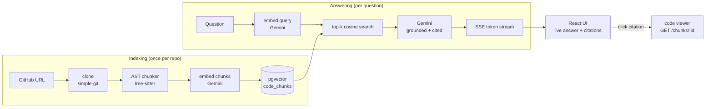
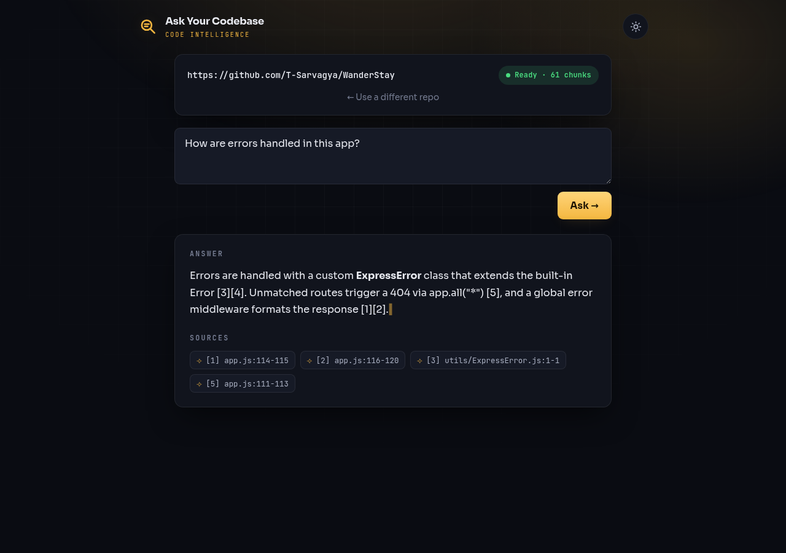
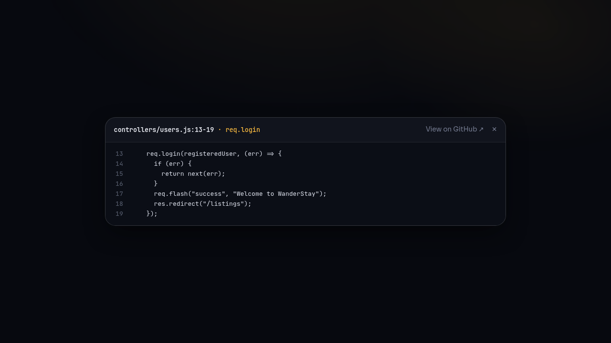

# Ask Your Codebase

> Point it at any **public GitHub repo**, and it indexes the code into a vector
> database so you can ask plain-English questions and get answers with
> **file + line citations** — streamed in live.

It's a **RAG** (Retrieval-Augmented Generation) app built carefully, not a
"wrap an LLM in a chat box" demo:

- **Real retrieval** — embeddings + pgvector cosine search, not keyword grep.
- **AST-aware chunking** — tree-sitter splits code on *function / class / method*
  boundaries, so each chunk is a whole semantic unit (a much cleaner embedding
  than a blind every-N-lines slice).
- **Grounded, cited answers** — the model must cite the exact snippets it used;
  every citation maps back to a real `file:line`, and answers that cite nothing
  are flagged as a possible hallucination.
- **Live streaming + in-app code viewer** — the answer streams token-by-token,
  and clicking a citation opens the cited code with line numbers.
- **Runs entirely on free tiers** — one Google Gemini key powers both embeddings
  and generation; Postgres + pgvector runs locally in Docker.

> New to the code? Read **[CODEBASE_GUIDE.md](./CODEBASE_GUIDE.md)** — a
> plain-English, file-by-file walkthrough of how the whole thing works.

---

## Architecture



| Layer | Tech |
| --- | --- |
| **Frontend** | React + TypeScript (Vite) — `frontend/` |
| **Backend** | NestJS + TypeScript — `backend/` |
| **Chunking** | tree-sitter (AST-aware: TS / TSX / JS / Python; line-window fallback) |
| **Embeddings** | Google Gemini `gemini-embedding-001` (768-dim) |
| **Generation** | Google Gemini `gemini-2.5-flash` via `@google/genai` (streaming) |
| **Vector store** | Postgres + `pgvector` (cosine distance, Docker) |

---

## Screenshots

<!--
  Add screenshots here once you've run it:
  1. Take a shot of (a) the streaming answer with citations, and (b) the code
     viewer open on a citation.
  2. Drag the images into this section on GitHub (or drop them in a docs/ folder)
     and reference them like:
        
        
-->

_Run it locally (below) and drop in a couple of screenshots — the streaming
answer with citations, and the code viewer open on one._

---

## Prerequisites

- **Node 18+** and **npm**
- **Docker** (for the Postgres + pgvector container)
- **One free API key** — **Gemini**, from Google AI Studio:
  https://aistudio.google.com/apikey (the developer API key, **not** the consumer
  "Gemini Advanced/Pro" app subscription). It powers both embeddings and answers.
  - Note: if a model reports `free tier limit 0` for your key, switch
    `GEMINI_MODEL` (e.g. to `gemini-2.5-flash-lite`) — see `.env.example`.

---

## Setup & run

```bash
# 1. From the repo root: copy the env template and add your Gemini key
cp .env.example backend/.env
#    then edit backend/.env -> set GEMINI_API_KEY

# 2. Start the vector database (Postgres + pgvector) in Docker
docker compose up -d

# 3. Backend (http://localhost:3000)
cd backend
npm install        # first time only
npm run start:dev  # boots, auto-creates the DB schema, watches for changes

# 4. Frontend (http://localhost:5173) — in a second terminal
cd frontend
npm install        # first time only
npm run dev
```

Open http://localhost:5173, paste a GitHub URL, wait for indexing to reach
**ready**, then ask a question. Start with a small repo — indexing time scales
with the amount of code.

---

## API (backend)

| Method | Route | Purpose |
| ------ | ----- | ------- |
| `POST` | `/repos` | Start indexing a repo. Body `{ url }`. Returns the new repo (status `pending`). |
| `GET`  | `/repos/:id` | Poll indexing status (`pending`→`cloning`→`chunking`→`embedding`→`ready`/`error`). |
| `POST` | `/repos/:id/ask` | Ask a question (one-shot). Body `{ question }`. Returns `{ answer, citations, grounded }`. |
| `POST` | `/repos/:id/ask/stream` | Same, but streams the answer as SSE frames (`sources` → `token`s → `done`). |
| `GET`  | `/chunks/:id` | Fetch one stored chunk's content (used by the in-app code viewer). |

---

## Deploying (free tiers)

The app is three pieces; each has a free host:

1. **Database — managed Postgres with `pgvector`.** Use a provider that supports
   the extension: **Neon**, **Supabase**, or **Render Postgres**. Create the DB,
   then run `CREATE EXTENSION vector;` once (the app's `schema.sql` also tries
   this on boot). Copy its connection string.
2. **Backend — NestJS** on **Render** / **Railway** / **Fly.io** (Node web
   service). Set env vars `DATABASE_URL`, `GEMINI_API_KEY`, `GEMINI_MODEL`,
   `EMBEDDING_MODEL`, `EMBEDDING_DIM`. Build: `npm install && npm run build`,
   start: `node dist/main.js`.
3. **Frontend — React/Vite** on **Vercel** or **Netlify**. Set `VITE_API_URL`
   to the deployed backend URL (see `frontend/.env.example`). Build: `npm run
   build`, output dir: `dist`.

Then tighten CORS in `backend/src/main.ts` from `enableCors()` to your frontend
origin.

---

## Limitations & future work

- **AST coverage** is best on declared functions/classes/methods and common
  callback patterns (Express routes, `.map`, event listeners). Deeply nested
  anonymous logic still falls back to line-window chunks.
- **Free-tier rate limits** — `gemini-2.5-flash` is ~10 requests/min on the free
  tier; rapid questions show a "wait ~30s" message. `gemini-2.5-flash-lite` has
  higher limits (one-line `.env` change).
- **One repo at a time** in the UI (the backend already supports many; multi-repo
  switching is a small addition).
- Changing the embedding model/dimension requires recreating the `code_chunks`
  table (the vector size is fixed in `schema.sql`).
- Ideas: hybrid search (vector + keyword), re-ranking, conversation memory,
  per-repo background re-indexing, and authentication for a hosted version.

---

## Project status

Built in milestones (full plan in `.claude/plans`):

- ✅ **M1 — Scaffold + infra:** monorepo, Docker pgvector, NestJS + Vite apps.
- ✅ **M2 — Ingest:** clone → walk → chunk → embed → store in pgvector.
- ✅ **M3 — Grounded answering:** top-k retrieval → Gemini → cited answer; React UI.
- ✅ **M4 — AST-aware chunking:** tree-sitter on function/class/method boundaries
  (TS/TSX/JS/Python), named chunks (`Class.method`, `router.get`), graceful fallback.
- ✅ **M5 — Token streaming + code viewer:** answers stream live over SSE; citations
  open the cited code in-app.
- ✅ **M6 — Polish:** architecture diagram, deploy notes, env templates, license.

---

## License

[MIT](./LICENSE) © 2026 Sarvagya Tiwari
